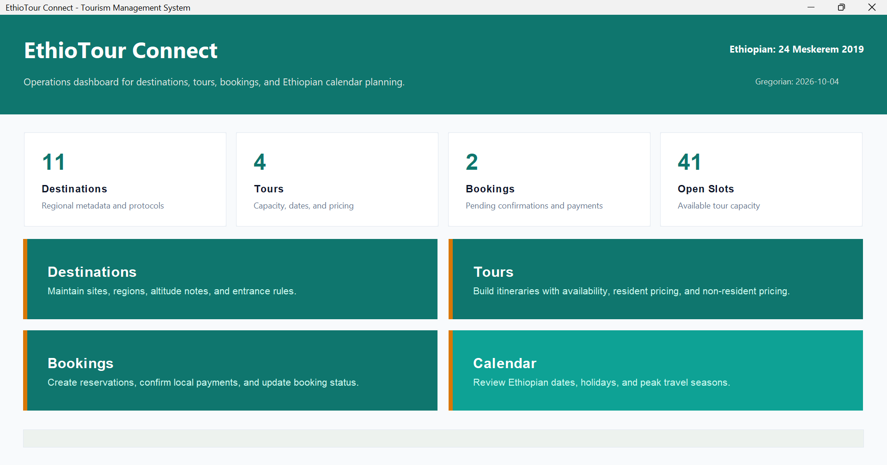
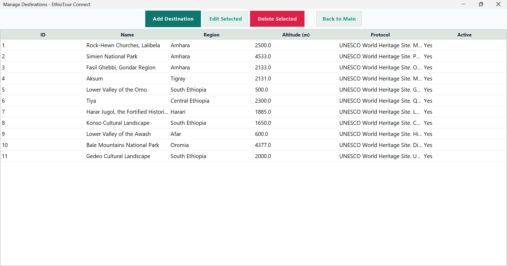
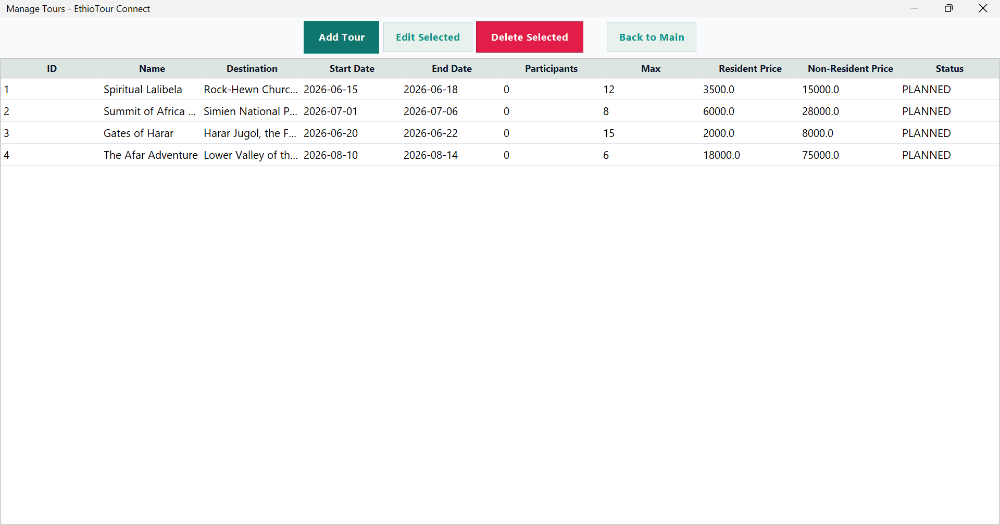
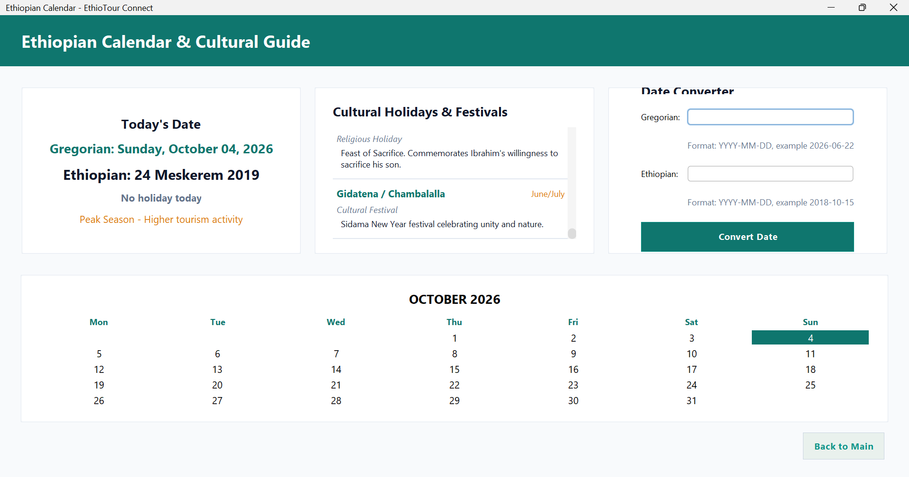

# EthioTour Connect

EthioTour Connect is a Java Swing desktop application prototype designed to support tourism management operations in Ethiopia.

The system provides modules for managing tourist destinations, tour packages, customer bookings, pricing, booking status, payments, and Ethiopian calendar information.

It was developed as a practical software project to demonstrate Java programming, GUI development, database integration, business logic, validation, and application security.

---

## Features

### 🏠 Dashboard
- Overview of the tourism management system
- Quick access to major application modules
- Ethiopian and Gregorian date information
- Application status and summary information

### 📍 Destination Management
- Add, view, edit, and delete destinations
- Store destination region and altitude
- Maintain descriptions and entrance protocol information
- Manage destination status

### 🚌 Tour Management
- Create and manage tour packages
- Assign destinations to tours
- Set travel dates
- Define participant capacity
- Configure resident and non-resident pricing
- Track tour availability

### 📋 Booking Management
- Create customer bookings
- Store customer contact information
- Select tours and participant numbers
- Validate tour capacity to prevent overbooking
- Calculate booking prices
- Track booking status

### 💳 Payment Management
- Record payment information
- Support simulated payment processing
- Store payment references
- Support Chapa test-payment integration

### 🇪🇹 Ethiopian Calendar
- Display Ethiopian calendar dates
- Convert between Ethiopian and Gregorian dates
- Display Ethiopian holidays
- Provide tourism season information

### 🔐 Application Security
- Password hashing
- Login rate limiting
- Input sanitization
- Protected authentication-related operations

---

## Screenshots

### Dashboard



### Destination Management



### Tour Management



### Booking Management


### Ethiopian Calendar



---

## Technologies Used

- **Java**
- **Java Swing**
- **Maven**
- **JDBC**
- **PostgreSQL**
- **SQLite**
- **HikariCP**
- **FlatLaf**
- **Chapa Test Payment Integration**
- **Git & GitHub**
- **GitHub Actions**

### Development Concepts Demonstrated

- Object-Oriented Programming
- MVC-style application structure
- CRUD operations
- Database connectivity
- Business logic and validation
- Authentication and security
- Exception handling
- GUI development
- File and configuration management
- Version control
- CI/CD

---

## Project Structure

```text
EthioTour-connect/
│
├── .github/
│   └── workflows/
│       └── build.yml
│
├── screenshots/
│   ├── dashboard.png
│   ├── destinations.png
│   ├── tours.png
│   ├── bookings.png
│   └── ethiopian-calendar.png
│
├── src/
│   └── main/
│       ├── java/
│       │   └── com/
│       │       └── ethiotour/
│       │           ├── config/
│       │           ├── controller/
│       │           ├── model/
│       │           ├── security/
│       │           ├── service/
│       │           ├── util/
│       │           ├── view/
│       │           ├── DemoApp.java
│       │           └── EthioTourApp.java
│       │
│       └── resources/
│
├── .gitignore
├── Dockerfile
├── docker-compose.yml
├── pom.xml
├── README.md
└── run.bat